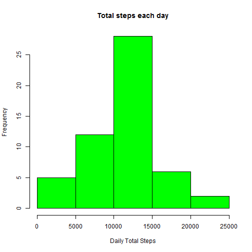
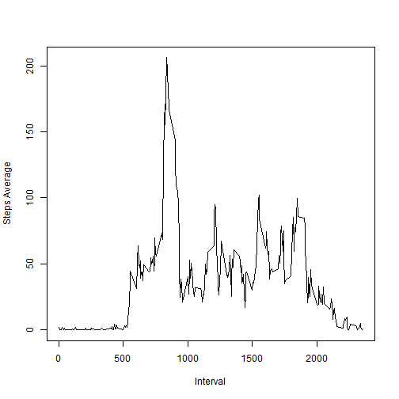
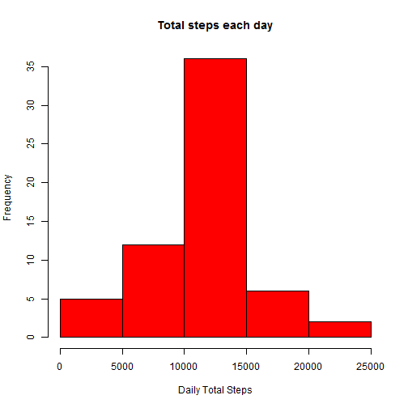
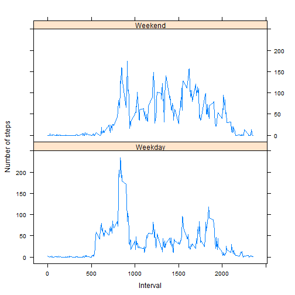

Reproducible Research - Peer Assessment 1
==========================================


We start the analysis by loading activity data (assume current working directory has been set correctly):


```r
activityData <- read.csv("repdata-data-activity/activity.csv")
```


### 1. Ignoring missing values, what is the mean total number of steps taken per day?

- Calculate daily total steps

```r
dailyTotalSteps <- aggregate(steps ~ date, data = activityData, FUN=sum, na.rm=TRUE)
```

- Make a histogram of the total number of steps taken each day

```r
hist(dailyTotalSteps$steps, col="green", xlab="Daily Total Steps", main="Total steps each day")
```

 

- Calculate the **mean** (10770) and **median** (10760) total number of steps taken per day

```r
summary(dailyTotalSteps$steps)
```

```
##    Min. 1st Qu.  Median    Mean 3rd Qu.    Max. 
##      41    8841   10760   10770   13290   21190
```


### 2. What is the average daily activity pattern  

- Calculate average steps per interval

```r
intervalAverageSteps <- aggregate(steps ~ interval, data=activityData, FUN=mean, na.rm=TRUE)
names(intervalAverageSteps) = c("interval","averageSteps")
```

- Make a time series plot of the 5-minute interval and the average number of steps taken, averaged across all days

```r
plot(intervalAverageSteps$interval, intervalAverageSteps$averageSteps, type="l", xlab="Interval", ylab="Steps Average")
```

 

- The 5-minute interval that contins the max number of steps is 835

```r
intervalAverageSteps[intervalAverageSteps$averageSteps == max(intervalAverageSteps$averageSteps), ]
```

```
##     interval averageSteps
## 104      835     206.1698
```


### 3. Imputting missing values

- the total number of missing values in the dataset is 2304

```r
length(which(is.na(activityData$steps)))
```

```
## [1] 2304
```

- extrapolate the original data set by filling in all missing values with the interval mean.  
The new data set is equal to the original dataset but with missign data filled in

```r
library(dplyr)
activityDataExtrapolated <- activityData %>%
  group_by(interval) %>%
  mutate(steps = ifelse(is.na(steps), mean(steps, na.rm=TRUE), steps))
```

- make a histogram of the total number of steps taken each day with the new data set

```r
dailyTotalStepsExtrapolated <- aggregate(steps ~ date, data = activityDataExtrapolated, FUN=sum, na.rm=TRUE)
hist(dailyTotalStepsExtrapolated$steps, col="red", xlab="Daily Total Steps", main="Total steps each day")
```

 

- calculate the **mean** (10770) and **median** (10770) total number of steps taken per day

```r
summary(dailyTotalStepsExtrapolated$steps)
```

```
##    Min. 1st Qu.  Median    Mean 3rd Qu.    Max. 
##      41    9819   10770   10770   12810   21190
```

**The result of imputing missing data results in an increase of median total daily number of steps.**


### 4. Are there differences in activity patterns between weekdays and weekends

- create a new factor variable in the dataset for 'weekday' and 'weekend', based on the day of the week

```r
activityData$day <- factor(ifelse(weekdays(as.Date(activityData$date)) %in% c('Saturday','Sunday'),'Weekend', 'Weekday'))
```

- panel plot of the average number of steps taken, averaged across weekdays and weekends

```r
intervalAverageSteps2 <- aggregate(steps ~ interval + day, data=activityData, FUN=mean, na.rm=TRUE)
library(lattice)
xyplot(steps ~ interval | day, data=intervalAverageSteps2, type="l", xlab="Interval", ylab="Number of steps", layout=c(1,2))
```

 

**This plot illustrates that while peak activity tends to be around intervals 750-950 both weekdays and weekends, intervals 950 to 2000 show a much higher activity on weekends than weekdays.**
